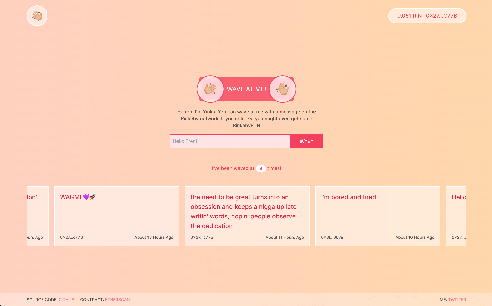

# Wave Portal

Send me a message on the blockchain!

My project for Buildspace's [Build a Web3 app with Solidity](https://buildspace.so/p/build-solidity-web3-app) with some personal modifications.



## Project Setup

### Prerequisites

- Node.js v14+
- MetaMask browser extension
- Sign up Alchemy and fill env.example
- Clone the repository

### Contract

```shell
cd contracts

# Install dependencies
yarn install

# Start the ethereum node
npx hardhat node

# run the contract
npx hardhat run scripts/run.js

# deploy the contract to local node
npx hardhat run scripts/deploy.js --network localhost

# deploy the contract to the rinkeby network
npx hardhat run scripts/deploy.js --network rinkeby
```

After contract is re-deployed don't forget to update the contract address and the ABI on the frontend.

### Interface

```shell
cd interface

# Install dependencies
yarn install

# Start development server
yarn dev
```
